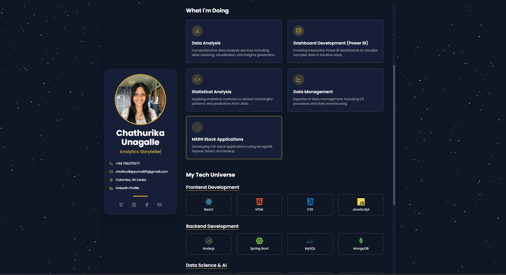
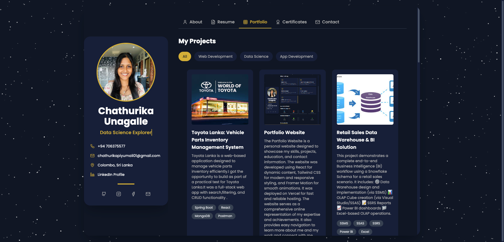
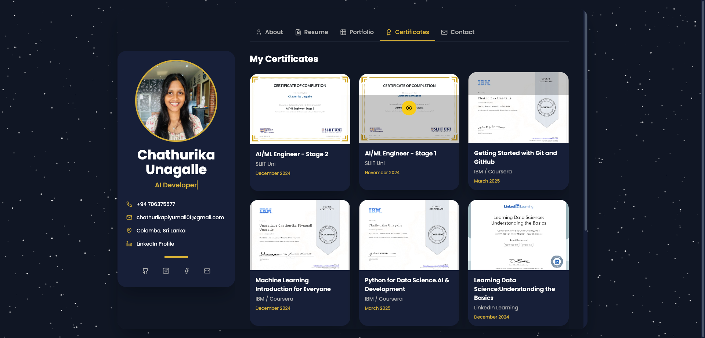
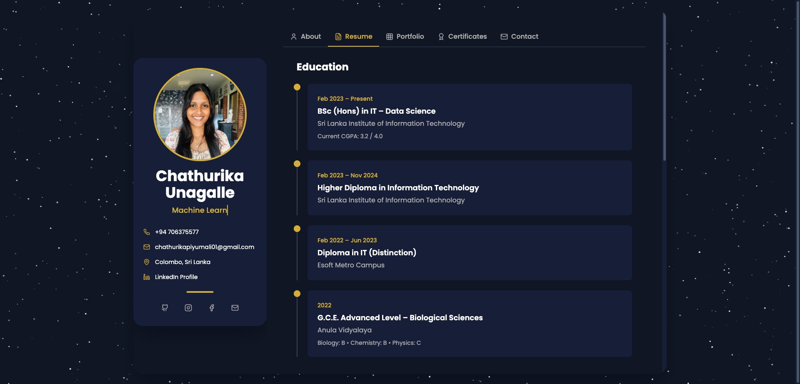

# Portfolio Website

Welcome to my personal portfolio website, built to showcase my work, skills, certifications, and contact information. Designed with modern UI/UX principles, this site highlights my background in Data Science, Full Stack Development, and AI/ML.

## 🔗 Live Site

👉 [chathurika.vercel.app](https://chathurika.vercel.app)

---

## 🛠️ Built With

- **React.js** – Frontend framework
- **TypeScript** – Type-safe development
- **Tailwind CSS** – Utility-first CSS framework
- **Framer Motion** – Smooth animations
- **EmailJS** – Contact form integration (no backend)
- **Vercel** – Hosting and deployment

---

